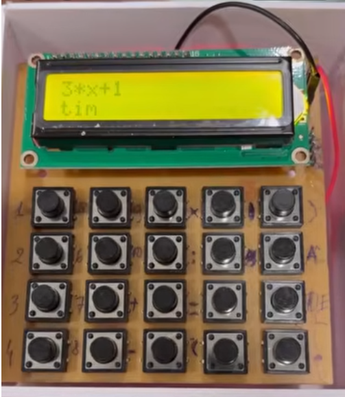
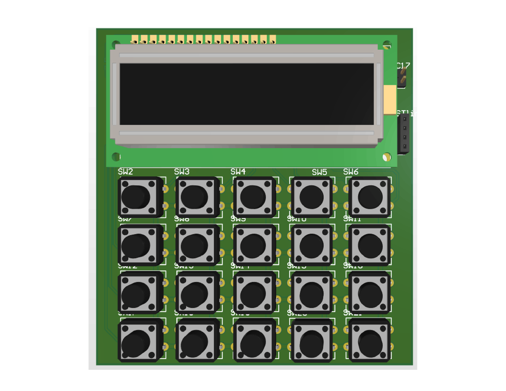
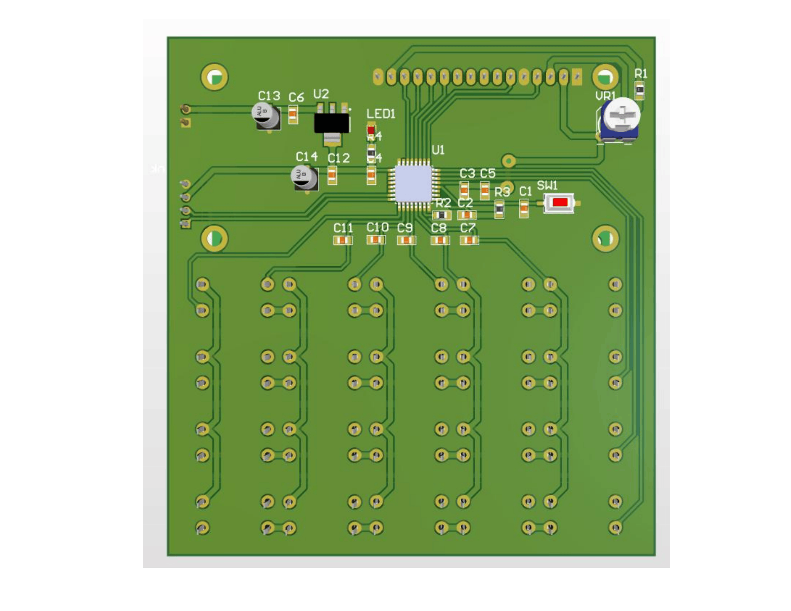
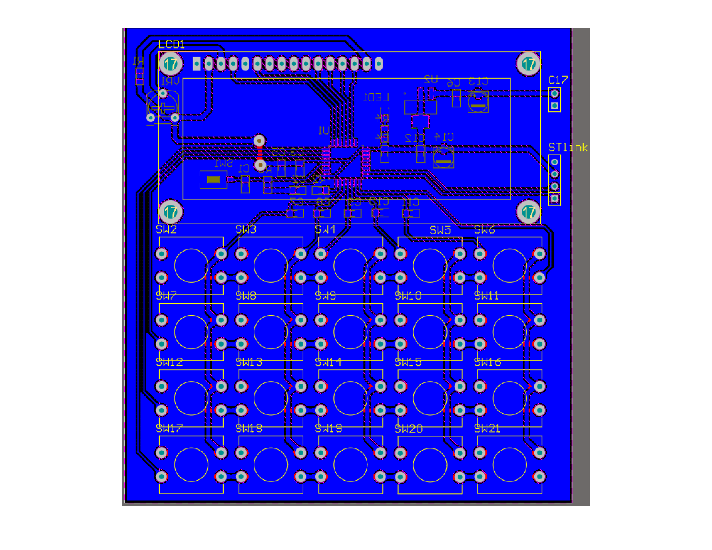
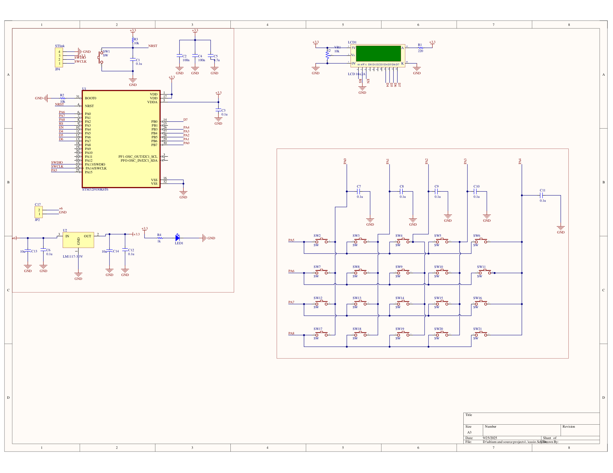

# STM32 Calculator - Custom Embedded Calculator System

## Demo

 <video src="https://github.com/user-attachments/assets/50ce03a3-e70b-4b47-9426-682c65b7a507" alt="Calculator beta" height=200/> 

---

## Documentation

| File | Description |
|---|---|
| [README.md](README.md) | Main project overview, hardware information, firmware features, and operating principle |
| [layout](./images/layout-1.png) | PCB layout designed using Altium Designer |
| [schematic](./images/schematic-1.png) | Hardware schematic diagram |
| [casio_stm32](./casio_stm32) | STM32 firmware source code |
| [casio_altium](./casio_altium) | PCB and schematic source files |

---

## Introduction

This project implements a handheld calculator system based on the STM32F030K6T6 microcontroller.

The calculator uses a custom-built 5x4 matrix keypad for user input and a 16x2 LCD (HD44780 driver) for displaying expressions and calculation results.

The project demonstrates embedded firmware development concepts including:

- GPIO control
- Matrix keypad scanning
- LCD interfacing in 4-bit mode
- FreeRTOS task management
- Embedded mathematical processing
- PCB design using Altium Designer

---

## Hardware

<table align="center">
  <tr>
    <td align="center">
      
    </td>
  </tr>
</table>

  <strong><em>Figure 1:</em></strong> STM32 Calculator Hardware Prototype

### Hardware Components

| Component | Description |
|---|---|
| MCU | STM32F030K6T6 |
| Input | 5x4 matrix keypad built using push buttons |
| Display | LCD 16x2 using HD44780 driver |
| RTOS | FreeRTOS |
| PCB | Custom PCB designed using Altium Designer |

---

## Features

### Arithmetic Operations
- Addition
- Subtraction
- Multiplication
- Division

### Equation Solving
- Linear equations (`ax + b = 0`)
- Quadratic equations (`ax² + bx + c = 0`)

### Embedded Features
- LCD 16x2 display output
- Matrix keypad scanning
- Key debounce handling
- FreeRTOS-based task scheduling

---

## System Operating Principle

The calculator firmware operates in two main modes:

### 1. Arithmetic Operation Mode
This mode performs standard arithmetic calculations using keypad input and displays the results on the LCD.

### 2. Equation Solving Mode
This mode allows users to solve:
- Linear equations
- Quadratic equations

The firmware processes keypad inputs, validates expressions, performs mathematical computations, and updates the LCD in real time.

---

## PCB Layout

  
  
  

  <strong><em>Figure 1:</em></strong> PCB Layout

---

## Schematic

  

  <strong><em>Figure 2:</em></strong> Hardware Schematic

---

## Getting Started

1. Open the project using STM32CubeIDE
2. Generate code using STM32CubeMX
3. Build the firmware
4. Flash the firmware using ST-LINK
5. Power the board and test calculator functions

---

## Software Environment

| Tool | Purpose |
|---|---|
| STM32CubeIDE | Firmware development |
| STM32CubeMX | Peripheral configuration |
| FreeRTOS | Real-time operating system |
| Altium Designer | PCB and schematic design |
| VS Code | Source code editing |

---
<h3>📫 Contact Me</h3>

  
  
  
  
  

